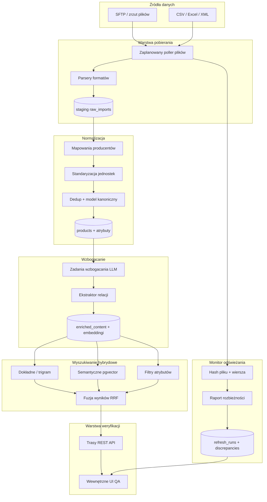
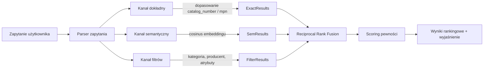

# Baza wiedzy produktowej — plan architektury

## Kontekst

Projekt greenfield w pustym workspace. Dane katalogowe docierają jako **pliki płaskie (CSV, Excel, XML)** przez **folder/SFTP**. Docelowe wdrożenie: **chmura zarządzana (Vercel + Neon Postgres)**. Skala: dziesiątki tysięcy SKU, setki kategorii — w pełni w zakresie Postgres + pgvector bez osobnego klastra wyszukiwania.

---

## Architektura wysokiego poziomu



---

## Stos technologiczny

| Warstwa | Wybór | Uzasadnienie |
|--------|--------|--------------|
| Aplikacja + API | **Next.js 15 (App Router)** na Vercel | Jedna baza kodu dla UI weryfikacji i API; pasuje do wymogu chmury zarządzanej |
| Baza danych | **Neon Postgres** + **pgvector** + **pg_trgm** | Jedno magazynowanie dla danych relacyjnych, pełnotekstowych, rozmytego dopasowania i wektorów semantycznych; bez dodatkowej infrastruktury wyszukiwania przy tej skali |
| ORM | **Drizzle** | Schemat jako kod, migracje kompatybilne z Neon |
| AI | **Vercel AI SDK** (`embed`, `generateObject`) | Embeddingi + strukturalne wzbogacanie z elastycznością dostawcy |
| Magazyn plików | **Vercel Blob** (lub S3-compatible) | Trwała strefa lądowania dla plików; Vercel nie ma trwałego dysku |
| Zadania w tle | **Vercel Cron** + handlery tras | Polling SFTP, kontrole odświeżania, wsadowe wzbogacanie |
| Monorepo | **pnpm workspaces** | Czysty podział: `apps/web`, `packages/db`, `packages/ingest`, `packages/search`, `packages/enrich`, `packages/refresh` |

---

## Kanoniczny model danych

Główne encje w [`packages/db`](packages/db):

- **`manufacturers`** — tożsamość źródła, odniesienie do konfiguracji mapowania
- **`import_runs`** — każda próba importu pliku (hash pliku, status, liczba wierszy, błędy)
- **`raw_import_rows`** — niesparsowane/stage’owane wiersze powiązane z `import_run_id` (payload JSONB)
- **`products`** — kanoniczny rekord produktu:
  - Identyfikatory: `catalog_number`, `mpn`, `gtin`, `manufacturer_id`
  - Pola podstawowe: `name`, `description`, `category_id`, `status`
  - **`attributes` JSONB** — znormalizowane specyfikacje klucz–wartość (napięcie, rozmiar gwintu, materiał itd.)
  - **`content_hash`** — SHA-256 znormalizowanego payloadu do wykrywania zmian
- **`categories`** — hierarchiczna taksonomia (parent_id, path, slug)
- **`enriched_content`** — pola generowane przez LLM z metadanymi pochodzenia:
  - `application_description`, `search_summary`, `relationships[]`, `confidence`, `model_version`, `source_refs`
- **`product_embeddings`** — vector(1536) na sklejonym tekście do wyszukiwania
- **`product_relationships`** — krawędzie typowane: `accessory`, `replacement`, `compatible_with`, `bundle`
- **`refresh_runs`** + **`discrepancies`** — ślad audytowy dryfu danych

Indeksy:
- B-tree na `catalog_number`, `mpn`, `gtin`
- GIN trigram na `catalog_number`, `name` (`pg_trgm`)
- GIN na `attributes` do zapytań filtrujących
- HNSW na `product_embeddings.embedding`

---

## Moduł 1: Pobieranie i normalizacja

### Polling plików
- Cron (np. co 15–60 min) łączy się z SFTP lub skanuje prefix Blob
- Oblicza **odcisk pliku** (SHA-256); pomija niezmienione pliki
- Zapisuje surowy plik w Blob; tworzy rekord `import_runs`

### Parsery ([`packages/ingest/parsers`](packages/ingest/parsers))
- CSV: `papaparse` z wykrywaniem kodowania
- Excel: `xlsx` / `exceljs`
- XML: parser strumieniowy z konfiguracją mapowania XPath
- Wszystkie parsery zwracają jednolity `RawRow { sourceRow, rawFields, parseErrors[] }`

### Konfiguracje mapowania producentów ([`configs/manufacturers/*.yaml`](configs/manufacturers))
Deklaratywne mapowanie per źródło — bez zmian w kodzie przy nowych dostawcach:

```yaml
manufacturer: acme-industrial
filePattern: "acme_*.csv"
delimiter: ";"
encoding: windows-1250
columns:
  catalog_number: { source: "ArtNr", transform: [trim, uppercase] }
  name: { source: "Bezeichnung" }
  voltage: { source: "Spannung", transform: [parseVoltage] }
  length_mm: { source: "Länge", transform: [parseLength, toMm] }
categoryRules:
  - match: { column: "Warengruppe", equals: "Schrauben" }
    category: "fasteners/bolts"
```

### Pipeline normalizacji ([`packages/ingest/normalize`](packages/ingest/normalize))
1. **Transformacje pól** — trim, reguły wielkości liter, parsowanie liczb z uwzględnieniem locale
2. **Standaryzacja jednostek** — kanoniczne jednostki SI w `attributes` (mm, V, A, Nm); oryginał w `attributes._raw`
3. **Mapowanie kategorii** — silnik reguł mapuje kategorie źródłowe na wewnętrzną taksonomię
4. **Deduplikacja** — upsert po `(manufacturer_id, catalog_number)`; flaga konfliktu przy tym samym kluczu i rozbieżnych hashach
5. **Walidacja** — wymagane pola, format identyfikatorów; nieprawidłowe wiersze w kwarantannie w `raw_import_rows` ze statusem `rejected`

---

## Moduł 2: Wzbogacanie

Zadanie wsadowe uruchamiane po udanej normalizacji nowych/zmienionych produktów ([`packages/enrich`](packages/enrich)):

### Wejścia na produkt
- Znormalizowana nazwa, opis, atrybuty, ścieżka kategorii, kontekst producenta

### Zadania LLM (strukturalny output przez `generateObject`)
1. **`application_description`** — gdzie/jak produkt jest używany (2–4 zdania, ton techniczny)
2. **`search_summary`** — gęsty akapit zoptymalizowany pod embedding (synonimy, alternatywne terminy, żargon branżowy)
3. **`relationships`** — sugerowane powiązania z innymi numerami katalogowymi z typem + pewnością + uzasadnieniem

### Zabezpieczenia
- Zapis `confidence` (0–1) i `model_version` przy każdym wzbogaceniu
- Wzbogacanie tylko produktów, u których `content_hash` zmienił się od ostatniego wzbogacenia
- Kolejka recenzji ludzkiej dla wzbogacenia o niskiej pewności (< 0,7) w UI weryfikacji
- Regeneracja embeddingów z: `name + search_summary + application_description + kluczowe atrybuty`

---

## Moduł 3: Silnik wyszukiwania hybrydowego

Implementacja w [`packages/search`](packages/search):



### Trzy kanały wyszukiwania
1. **Dokładny** — równość na `catalog_number`/`mpn`/`gtin`; zapasowo podobieństwo trigramowe przy literówkach
2. **Semantyczny** — embedding zapytania → wyszukiwanie cosinusowe na `product_embeddings` (top-K=50)
3. **Filtry** — strukturalne filtry atrybutów JSONB + drzewo kategorii + producent

### Fuzja i pewność ([`packages/search/scoring.ts`](packages/search/scoring.ts))
- **RRF** łączy listy rankingowe z każdego kanału
- **Wynik pewności** (0–1) na wynik składa się z:
  - `exact_match_boost` — 1,0 przy trafieniu dokładnego identyfikatora
  - `semantic_similarity` — znormalizowana odległość cosinusowa
  - `filter_completeness` — ułamek dopasowanych żądanych filtrów
  - `data_quality` — pewność wzbogacenia × kompletność atrybutów
  - `freshness` — kara za nieaktualne/niezweryfikowane rekordy
- Zwracany obiekt **`explanation`** na wynik (który kanał trafił, które pola, rozbicie score) — kluczowe dla UI weryfikacji

### API
- `POST /api/search` — `{ query, filters, limit, explain: true }`
- `GET /api/products/:id` — pełny produkt + wzbogacenie + relacje

---

## Moduł 4: Odświeżanie bazy i raportowanie rozbieżności

[`packages/refresh`](packages/refresh):

### Wykrywanie zmian (dwa poziomy)
1. **Poziom pliku** — SHA-256 całego pliku; pomijanie ponownego przetwarzania bez zmian
2. **Poziom wiersza** — `content_hash` znormalizowanego produktu; wykrywanie:
   - `added` — nowy numer katalogowy
   - `updated` — ten sam klucz, inny hash
   - `removed` — w bazie, brak w najnowszym pliku źródłowym
   - `conflict` — ten sam klucz, niezgodne zmiany pól między źródłami

### Przebieg uruchomienia odświeżania
1. Cron uruchamia `refresh_runs` dla każdego skonfigurowanego źródła
2. Import + normalizacja jak zwykle
3. Diff względem bieżącego snapshotu `products`
4. Zapis rekordów `discrepancies` z ważnością (`info`, `warning`, `error`)
5. Podsumowanie: liczniki wg typu, linki do dotkniętych produktów

### Raportowanie
- `GET /api/refresh/runs` — historia z podsumowaniami
- `GET /api/refresh/runs/:id/discrepancies` — stronicowana lista rozbieżności
- Opcjonalny webhook/e-mail (faza 2) dla konfliktów o ważności `error`

---

## Moduł 5: API weryfikacji i wewnętrzne UI

To nie frontend produkcyjny — wewnętrzne narzędzie QA w [`apps/web`](apps/web):

| Ekran | Cel |
|-------|-----|
| **Search Playground** | Uruchamianie zapytań, przełączanie kanałów, inspekcja rozbicia score i wyjaśnień |
| **Product Inspector** | Widok pipeline surowe → znormalizowane → wzbogacone dla pojedynczego SKU |
| **Enrichment Review** | Kolejka wzbogacenia o niskiej pewności; zatwierdzanie/odrzucanie/edycja |
| **Refresh Dashboard** | Najnowsze raporty rozbieżności, drill-down do produktów |
| **Ingest Monitor** | Historia importów, błędy parsowania, wiersze w kwarantannie |

Autoryzacja: prosty klucz API lub ochrona hasłem Vercel do użytku wewnętrznego (bez auth użytkownika końcowego w v1).

---

## Struktura projektu

```
product-knowledge-base/
├── apps/
│   └── web/                          # Aplikacja Next.js (trasy API + UI weryfikacji)
│       ├── app/
│       │   ├── api/
│       │   │   ├── search/route.ts
│       │   │   ├── products/[id]/route.ts
│       │   │   ├── ingest/route.ts       # ręczny upload pliku
│       │   │   ├── refresh/route.ts      # cel crona
│       │   │   └── enrich/route.ts       # cel crona
│       │   ├── search/                   # strona search playground
│       │   ├── products/[id]/           # inspektor produktu
│       │   ├── review/                   # kolejka recenzji wzbogacenia
│       │   └── refresh/                  # dashboard rozbieżności
│       └── vercel.json                   # harmonogramy cron
├── packages/
│   ├── db/                           # Schemat Drizzle, migracje, klient
│   ├── ingest/                       # parsery, normalizer, silnik mapowania
│   ├── enrich/                       # wzbogacanie LLM + generowanie embeddingów
│   ├── search/                       # wyszukiwanie hybrydowe + scoring
│   └── refresh/                      # hashowanie, diff, raporty rozbieżności
├── configs/
│   └── manufacturers/                # konfiguracje YAML mapowania per źródło
├── scripts/
│   └── seed-sample-data.ts           # fixture dev z przykładowych CSV
├── pnpm-workspace.yaml
└── .env.example
```

---

## Kluczowe decyzje projektowe

1. **Wyszukiwanie tylko w Postgres** — unika operowania Elasticsearch przy skali 10K–100K SKU; pgvector HNSW + pg_trgm wystarcza na dokładne + rozmyte + semantyczne
2. **Pobieranie sterowane konfiguracją** — nowi producenci przez YAML, bez wdrożeń kodu
3. **Hashowanie contentu wszędzie** — tanie, deterministyczne wykrywanie zmian bez diffowania surowych plików wiersz po wierszu w aplikacji
4. **Wyjaśnialne score pewności** — UI weryfikacji i kolejne moduły AI muszą wiedzieć, *dlaczego* wynik rankuje wysoko
5. **Rozdzielenie kanonicznego vs wzbogaconego** — normalizacja jest deterministyczna; wzbogacenie jest wersjonowane i podlega recenzji

---

## Zmienne środowiskowe

```
DATABASE_URL=              # połączenie pooled Neon
DATABASE_URL_DIRECT=       # połączenie direct (migracje)
BLOB_READ_WRITE_TOKEN=     # Vercel Blob
OPENAI_API_KEY=            # embeddingi + wzbogacanie (lub inny dostawca AI SDK)
SFTP_HOST / SFTP_USER / SFTP_PASS / SFTP_PATH=   # źródło zrzutu plików
CRON_SECRET=               # ochrona endpointów cron
API_KEY=                   # auth wewnętrznego API
```

---

## Ryzyka i mitygacje

| Ryzyko | Mitygacja |
|--------|-----------|
| Zróżnicowane formaty producentów | Konfiguracje mapowania YAML + kolejka kwarantanny dla niezmapowanych wierszy |
| Halucynacje LLM we wzbogaceniu | Strukturalny output, score pewności, kolejka recenzji ludzkiej |
| Timeout funkcji Vercel przy dużych plikach | Parsowanie strumieniowe; przetwarzanie wsadowe; ciężkie zadania w chunkowanych wywołaniach cron |
| Trudna ocena jakości wyszukiwania | Wczesny oznaczony zestaw ewaluacyjny; śledzenie precision@5 w CI |
| Dane uwierzytelniające SFTP w serverless | Przechowywanie w zmiennych Vercel; krótkotrwałe połączenia na uruchomienie cron |

---

Instrukcja uruchomienia dla developerów: [docs/SETUP.md](docs/SETUP.md)
